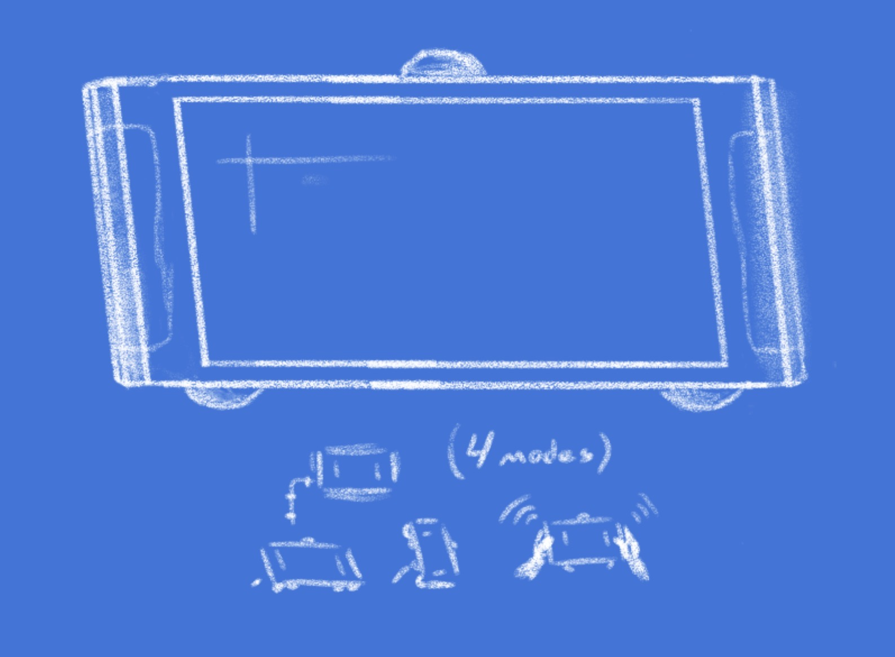

# rc-soar
*"**s**on **o**f r**a**pid**r**iter"*

A new toy for the hub. Portable, full color LED sign with goodies.

## Electronic

* ESP32-S2 (via [Adafruit Feather S2](https://www.adafruit.com/product/5000))
* 64x32 [LED matrix](https://www.waveshare.com/wiki/RGB-Matrix-P4-64x32)
* Pimoroni ["sensor stick"](https://shop.pimoroni.com/products/multi-sensor-stick?variant=42169525633107)
  - Sixaxis motion detection
  - Atmosphere sensing (temp/pressure/humidity)
  - Light and proximity 
* Spinny wheel 
* Batteries (maybe)

## Digital

Software stack is CircuitPython. 

It should have an idle mode that works like Rapidriter's, i.e. programmable. Then, I dunno, have apps be selectable via wheel?

## Physical

Late-night concept art. Big stubby handles for accelerometer games, a stand that holds it up in either orientation. Circular motif between handles, feet, and top knob.

## Todo

All of it. 
